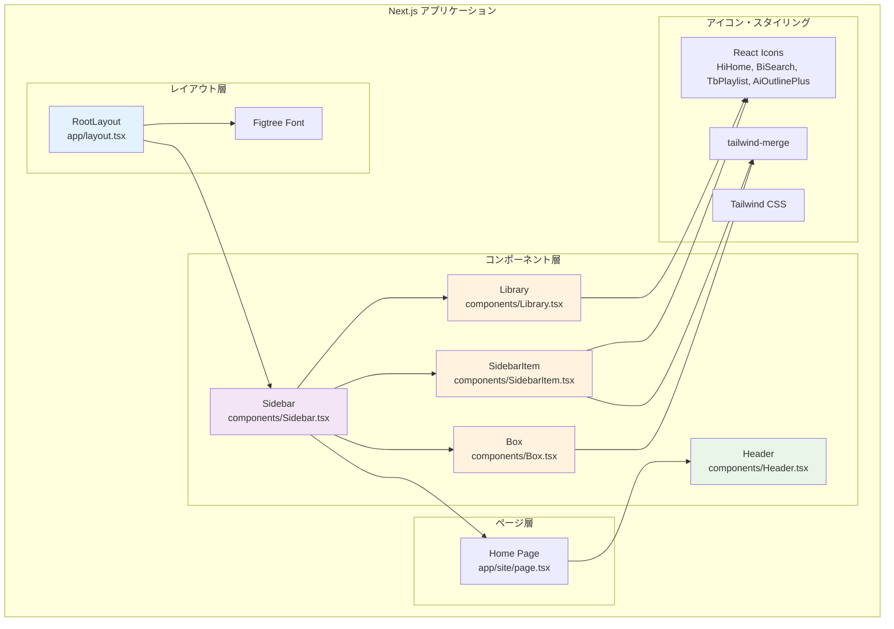
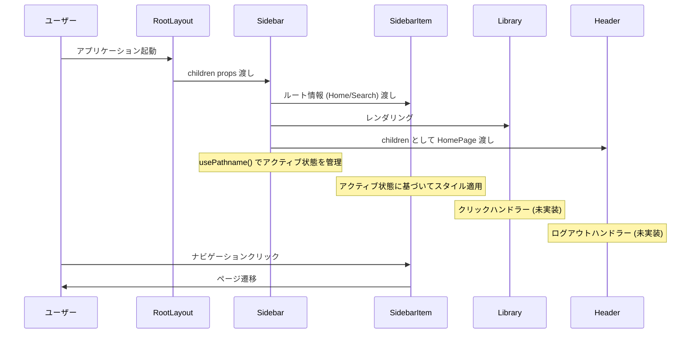
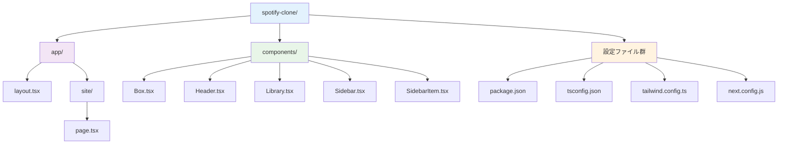
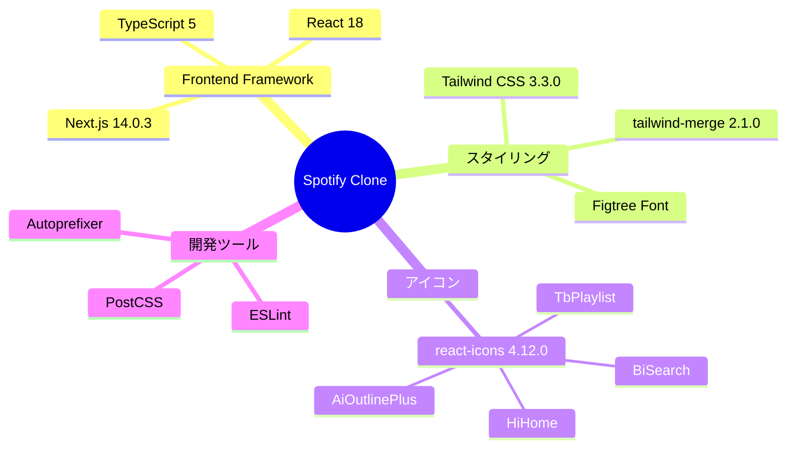

# Spotify Clone アーキテクチャ図

## コンポーネント構造



## データフロー



## コンポーネント関係図

```mermaid
classDiagram
    class RootLayout {
        +children: ReactNode
        +font: Figtree
        +metadata: Metadata
    }
    
    class Sidebar {
        +children: ReactNode
        +pathname: string
        +routes: Route[]
        +useMemo()
        +usePathname()
    }
    
    class SidebarItem {
        +icon: IconType
        +label: string
        +active: boolean
        +href: string
    }
    
    class Box {
        +children: ReactNode
        +className: string
        +twMerge()
    }
    
    class Library {
        +onClick()
    }
    
    class Header {
        +children: ReactNode
        +className: string
        +handleLogout()
    }
    
    class HomePage {
        +Header
    }
    
    RootLayout ||--|| Sidebar : contains
    Sidebar ||--o{ SidebarItem : renders
    Sidebar ||--|| Library : contains
    Sidebar ||--|| Box : wraps content
    HomePage ||--|| Header : contains
    
    Box <|-- SidebarItem : styled by
    Box <|-- Library : wrapped by
```

## ファイル構造



## 技術スタック



## 現在の実装状況

### ✅ 実装済み
- レスポンシブサイドバー (モバイルでは非表示)
- ナビゲーション (Home/Search)
- アクティブ状態の管理
- 基本的なUIコンポーネント
- Tailwind CSSによるスタイリング

### 🔄 実装中
- Header コンポーネント (基本構造のみ)
- Library コンポーネント (UI のみ)

### ⏳ 未実装 (TODO)
- ユーザー認証・ログアウト機能
- 音楽アップロード機能
- プレイリスト管理
- 音楽再生機能
- 検索機能
- ユーザープロフィール

## 設計パターン

### コンポーネント設計
- **Container/Presentational パターン**: Sidebar が状態管理、SidebarItem が表示のみ
- **Compound Component パターン**: Box コンポーネントが他のコンポーネントをラップ
- **Props Drilling**: 必要最小限のプロップス渡し

### 状態管理
- **Next.js Hooks**: `usePathname()` でルーティング状態管理
- **React Hooks**: `useMemo()` でパフォーマンス最適化
- **Client Component**: "use client" ディレクティブで適切に分離

### スタイリング戦略
- **Utility-First**: Tailwind CSS によるユーティリティクラス
- **Dynamic Styling**: `twMerge()` による条件付きスタイリング
- **Responsive Design**: モバイルファーストのレスポンシブ設計