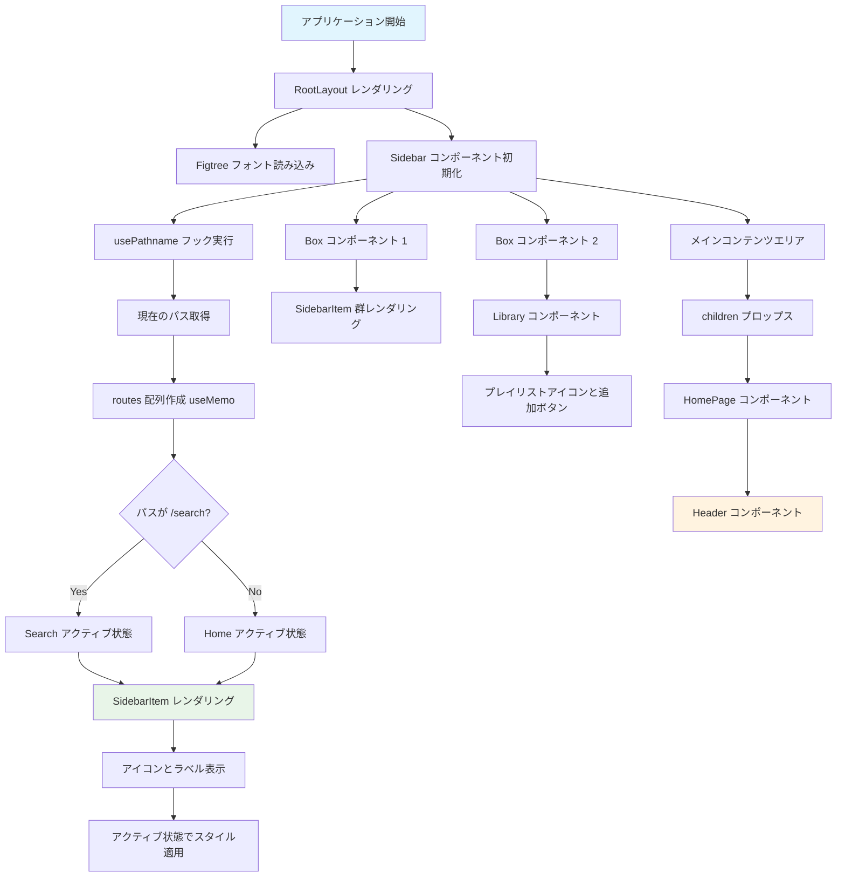
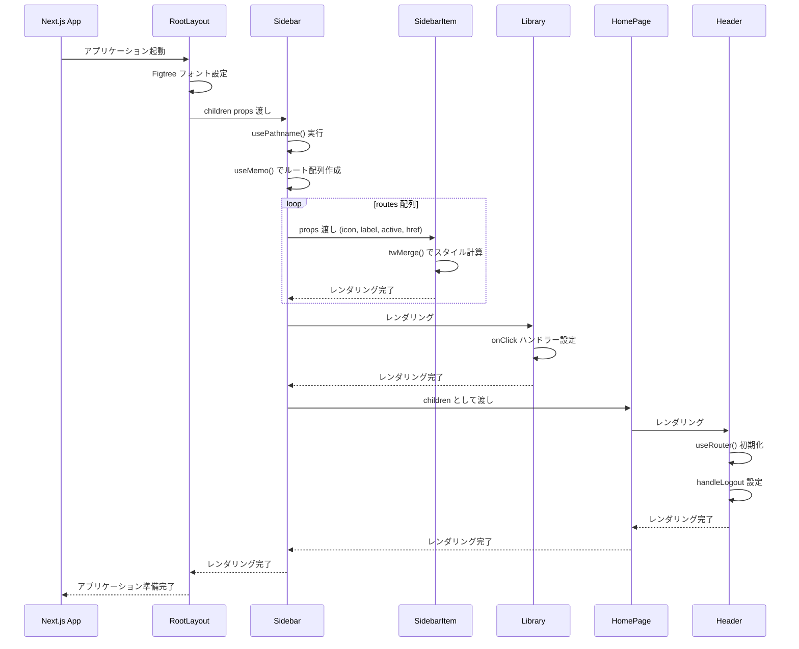
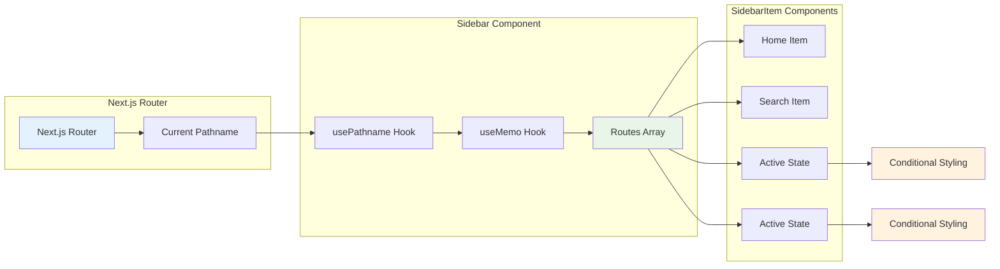
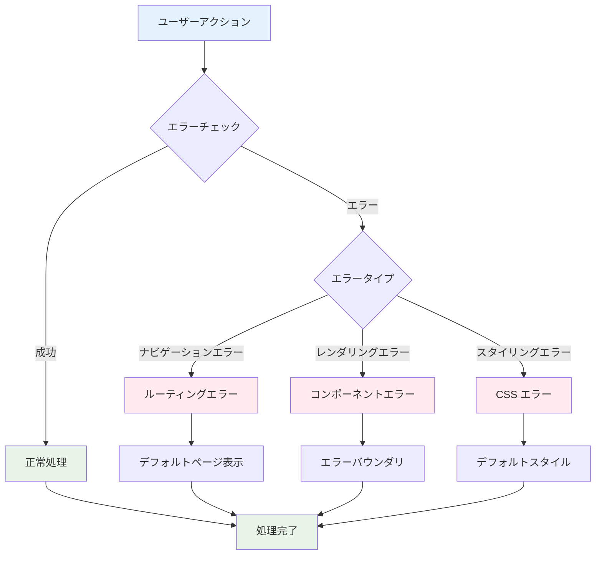
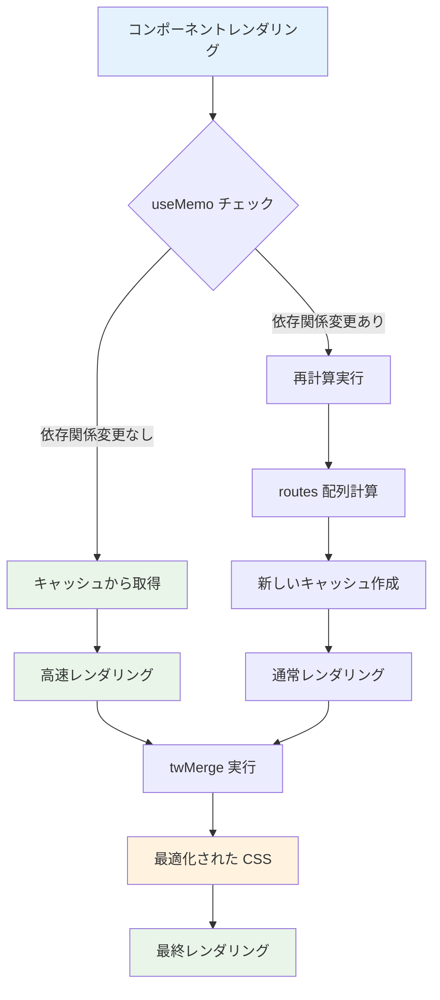
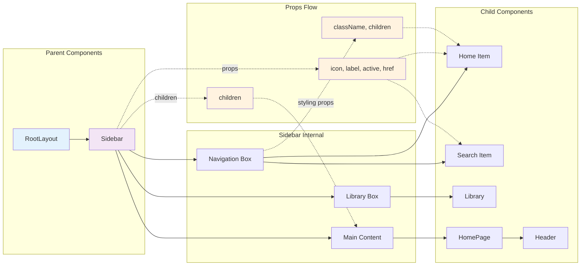

# Spotify Clone コンポーネントフロー図

## レンダリングフロー



## ユーザーインタラクションフロー

```mermaid
flowchart TD
    Start[ユーザーアクション] --> Check{アクションタイプ}
    
    Check -->|ナビゲーションクリック| Nav[SidebarItem クリック]
    Check -->|追加ボタンクリック| Add[Library 追加ボタン]
    Check -->|ログアウトクリック| Logout[Header ログアウト]
    
    Nav --> NavCheck{どのナビゲーション?}
    NavCheck -->|Home| HomeAction[/ パスに遷移]
    NavCheck -->|Search| SearchAction[/search パスに遷移]
    
    HomeAction --> UpdatePath[パス状態更新]
    SearchAction --> UpdatePath
    UpdatePath --> ReRender[コンポーネント再レンダリング]
    ReRender --> UpdateActive[アクティブ状態更新]
    UpdateActive --> End[完了]
    
    Add --> AddHandler[onClick ハンドラー実行]
    AddHandler --> AddTodo[TODO: アップロード機能]
    AddTodo --> End
    
    Logout --> LogoutHandler[handleLogout 実行]
    LogoutHandler --> LogoutTodo[TODO: ログアウト機能]
    LogoutTodo --> End
    
    style Start fill:#e3f2fd
    style End fill:#e8f5e8
    style AddTodo fill:#ffeb3b
    style LogoutTodo fill:#ffeb3b
```

## コンポーネント初期化シーケンス



## 状態管理フロー



## エラーハンドリングフロー



## パフォーマンス最適化フロー



## コンポーネント通信フロー

