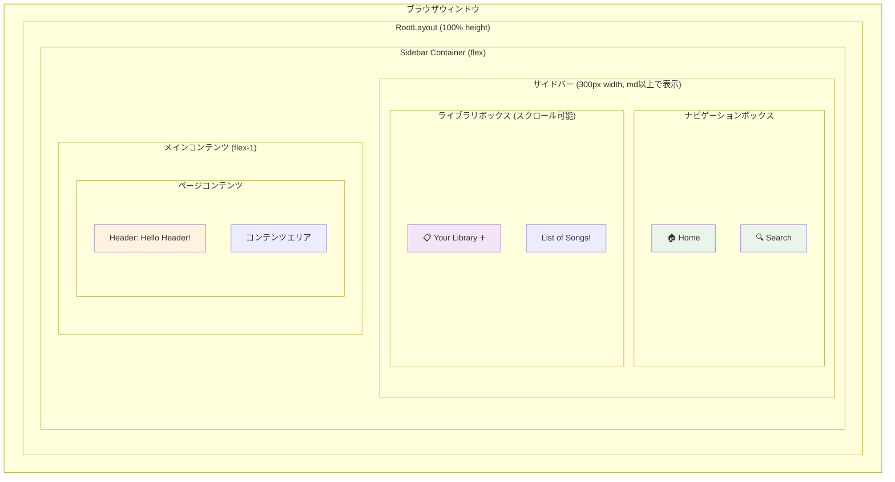
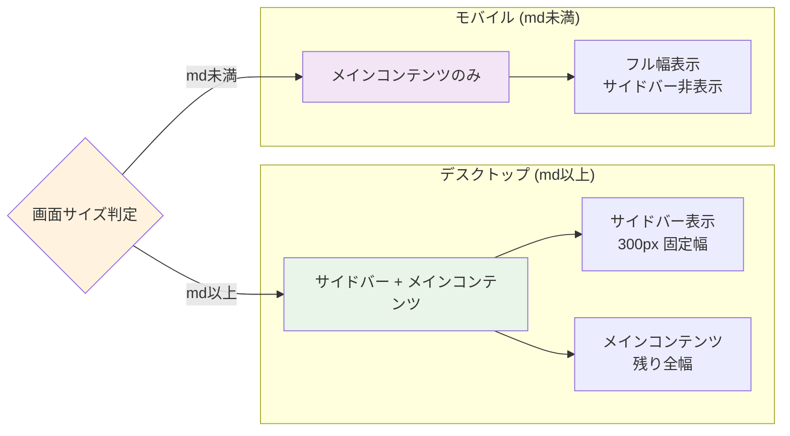
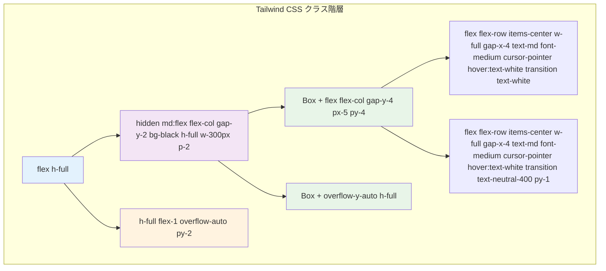
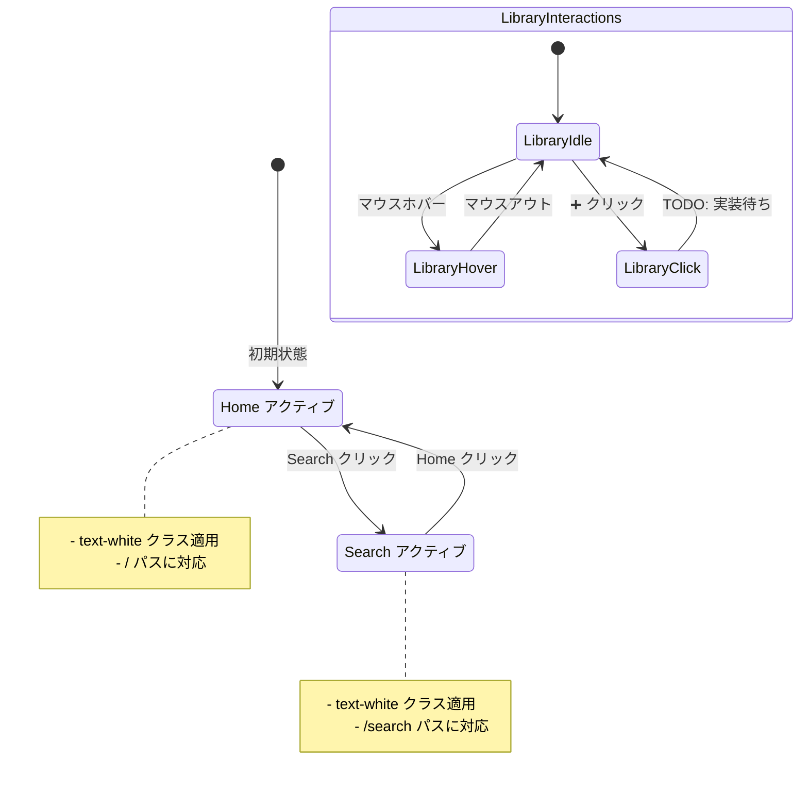
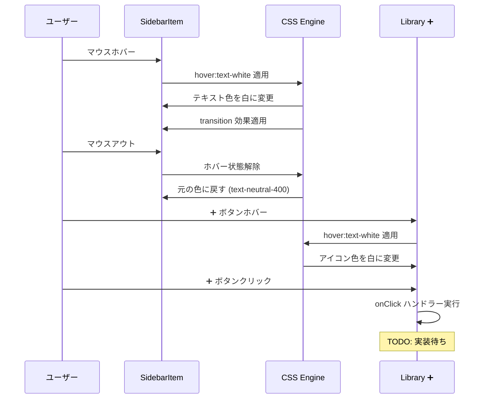
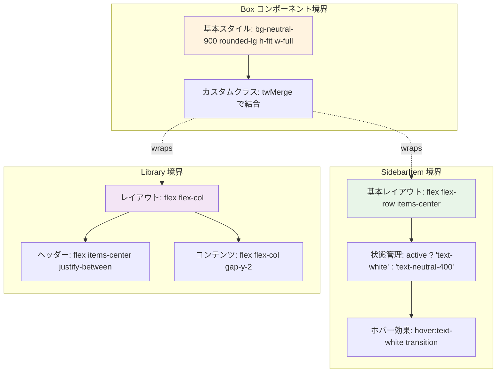
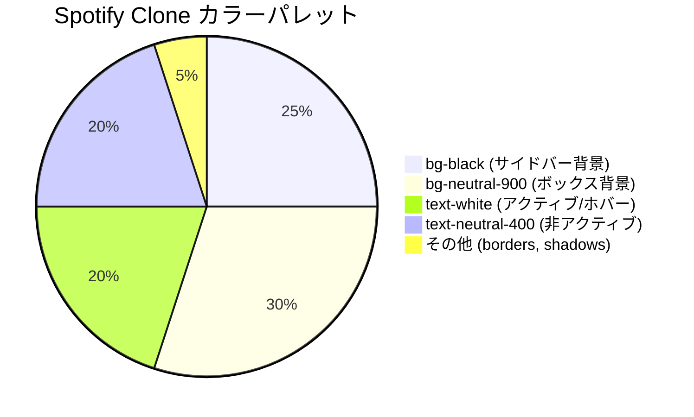
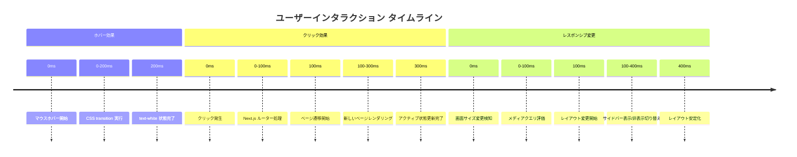
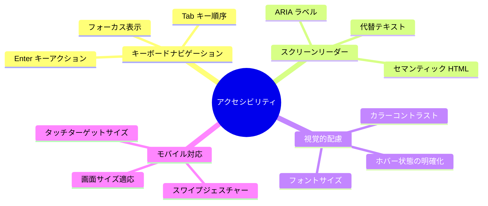

# Spotify Clone UI レイアウト図

## 画面レイアウト構造

```mermaid
graph TB
    subgraph "ブラウザウィンドウ"
        subgraph "RootLayout (100% height)"
            subgraph "Sidebar Container (flex)"
                subgraph "サイドバー (300px width, md以上で表示)"
                    subgraph "ナビゲーションボックス"
                        HomeItem[🏠 Home]
                        SearchItem[🔍 Search]
                    end
                    subgraph "ライブラリボックス (スクロール可能)"
                        LibraryHeader[📋 Your Library ➕]
                        LibraryContent[List of Songs!]
                    end
                end
                subgraph "メインコンテンツ (flex-1)"
                    subgraph "ページコンテンツ"
                        HeaderSection[Header: Hello Header!]
                        ContentArea[コンテンツエリア]
                    end
                end
            end
        end
    end
    
    style HomeItem fill:#e8f5e8
    style SearchItem fill:#e8f5e8
    style LibraryHeader fill:#f3e5f5
    style HeaderSection fill:#fff3e0
```

## レスポンシブレイアウト

```mermaid
flowchart LR
    subgraph "デスクトップ (md以上)"
        Desktop[サイドバー + メインコンテンツ]
        DesktopSidebar[サイドバー表示<br/>300px 固定幅]
        DesktopMain[メインコンテンツ<br/>残り全幅]
        Desktop --> DesktopSidebar
        Desktop --> DesktopMain
    end
    
    subgraph "モバイル (md未満)"
        Mobile[メインコンテンツのみ]
        MobileFull[フル幅表示<br/>サイドバー非表示]
        Mobile --> MobileFull
    end
    
    MediaQuery{画面サイズ判定} 
    MediaQuery -->|md以上| Desktop
    MediaQuery -->|md未満| Mobile
    
    style Desktop fill:#e8f5e8
    style Mobile fill:#f3e5f5
    style MediaQuery fill:#fff3e0
```

## CSS クラス構造

```mermaid
graph TD
    subgraph "Tailwind CSS クラス階層"
        Layout[flex h-full]
        
        SidebarContainer[hidden md:flex flex-col gap-y-2 bg-black h-full w-300px p-2]
        
        NavBox[Box + flex flex-col gap-y-4 px-5 py-4]
        
        LibraryBox[Box + overflow-y-auto h-full]
        
        MainContent[h-full flex-1 overflow-auto py-2]
        
        SidebarItemActive[flex flex-row items-center w-full gap-x-4 text-md font-medium cursor-pointer hover:text-white transition text-white]
        
        SidebarItemInactive[flex flex-row items-center w-full gap-x-4 text-md font-medium cursor-pointer hover:text-white transition text-neutral-400 py-1]
    end
    
    Layout --> SidebarContainer
    Layout --> MainContent
    SidebarContainer --> NavBox
    SidebarContainer --> LibraryBox
    NavBox --> SidebarItemActive
    NavBox --> SidebarItemInactive
    
    style Layout fill:#e3f2fd
    style SidebarContainer fill:#f3e5f5
    style NavBox fill:#e8f5e8
    style LibraryBox fill:#e8f5e8
    style MainContent fill:#fff3e0
```

## インタラクティブ要素

```mermaid
stateDiagram-v2
    [*] --> HomeActive : 初期状態
    
    HomeActive : Home アクティブ
    SearchActive : Search アクティブ
    
    HomeActive --> SearchActive : Search クリック
    SearchActive --> HomeActive : Home クリック
    
    note right of HomeActive
        - text-white クラス適用
        - / パスに対応
    end note
    
    note right of SearchActive
        - text-white クラス適用  
        - /search パスに対応
    end note
    
    state LibraryInteractions {
        [*] --> LibraryIdle
        LibraryIdle --> LibraryHover : マウスホバー
        LibraryHover --> LibraryIdle : マウスアウト
        LibraryIdle --> LibraryClick : ➕ クリック
        LibraryClick --> LibraryIdle : TODO: 実装待ち
    }
```

## ホバーエフェクト

```mermaid
sequenceDiagram
    participant User as ユーザー
    participant SidebarItem as SidebarItem
    participant CSS as CSS Engine
    participant Library as Library ➕
    
    User->>SidebarItem: マウスホバー
    SidebarItem->>CSS: hover:text-white 適用
    CSS->>SidebarItem: テキスト色を白に変更
    CSS->>SidebarItem: transition 効果適用
    
    User->>SidebarItem: マウスアウト
    SidebarItem->>CSS: ホバー状態解除
    CSS->>SidebarItem: 元の色に戻す (text-neutral-400)
    
    User->>Library: ➕ ボタンホバー
    Library->>CSS: hover:text-white 適用
    CSS->>Library: アイコン色を白に変更
    
    User->>Library: ➕ ボタンクリック
    Library->>Library: onClick ハンドラー実行
    Note over Library: TODO: 実装待ち
```

## コンポーネント境界とスタイリング

```mermaid
graph TB
    subgraph "Box コンポーネント境界"
        BoxBase[基本スタイル: bg-neutral-900 rounded-lg h-fit w-full]
        BoxCustom[カスタムクラス: twMerge で結合]
        BoxBase --> BoxCustom
    end
    
    subgraph "SidebarItem 境界"
        ItemBase[基本レイアウト: flex flex-row items-center]
        ItemState[状態管理: active ? 'text-white' : 'text-neutral-400']
        ItemHover[ホバー効果: hover:text-white transition]
        ItemBase --> ItemState
        ItemState --> ItemHover
    end
    
    subgraph "Library 境界"
        LibraryLayout[レイアウト: flex flex-col]
        LibraryHeader[ヘッダー: flex items-center justify-between]
        LibraryContent[コンテンツ: flex flex-col gap-y-2]
        LibraryLayout --> LibraryHeader
        LibraryLayout --> LibraryContent
    end
    
    BoxCustom -.->|wraps| ItemBase
    BoxCustom -.->|wraps| LibraryLayout
    
    style BoxBase fill:#fff3e0
    style ItemBase fill:#e8f5e8
    style LibraryLayout fill:#f3e5f5
```

## カラーパレット

```mermaid
pie title Spotify Clone カラーパレット
    "bg-black (サイドバー背景)" : 25
    "bg-neutral-900 (ボックス背景)" : 30
    "text-white (アクティブ/ホバー)" : 20
    "text-neutral-400 (非アクティブ)" : 20
    "その他 (borders, shadows)" : 5
```

## アニメーション・トランジション

```mermaid
timeline
    title ユーザーインタラクション タイムライン
    
    section ホバー効果
        0ms    : マウスホバー開始
        0-200ms : CSS transition 実行
        200ms   : text-white 状態完了
        
    section クリック効果
        0ms     : クリック発生
        0-100ms : Next.js ルーター処理
        100ms   : ページ遷移開始
        100-300ms : 新しいページレンダリング
        300ms   : アクティブ状態更新完了
        
    section レスポンシブ変更
        0ms     : 画面サイズ変更検知
        0-100ms : メディアクエリ評価
        100ms   : レイアウト変更開始
        100-400ms : サイドバー表示/非表示切り替え
        400ms   : レイアウト安定化
```

## アクセシビリティ要素

```mermaid
mindmap
  root((アクセシビリティ))
    キーボードナビゲーション
      Tab キー順序
      Enter キーアクション
      フォーカス表示
    スクリーンリーダー
      セマンティック HTML
      ARIA ラベル
      代替テキスト
    視覚的配慮
      カラーコントラスト
      フォントサイズ
      ホバー状態の明確化
    モバイル対応
      タッチターゲットサイズ
      スワイプジェスチャー
      画面サイズ適応
```